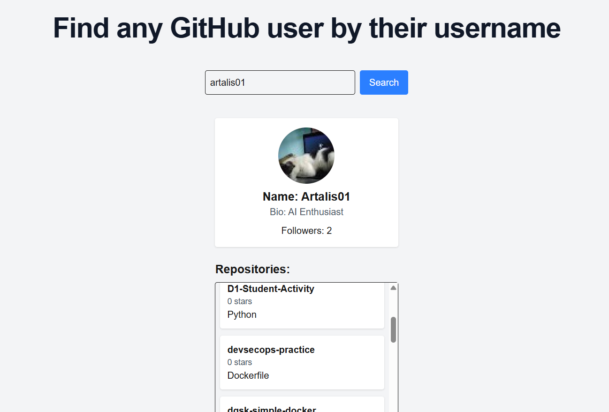

# DevFinder Lite 🔍

DevFinder Lite is a simple web application to search and explore GitHub users and their repositories.

## Features
- Search GitHub users by username
- Display user profile (avatar, bio, followers)
- View list of repositories
- Show repository stars and language
- Loading state handling
- Error handling for invalid users
- Keyboard-friendly UX (Enter to focus & search)

## Tech Stack
- TypeScript
- Next.js
- Tailwind CSS
- GitHub REST API

## Getting Started

### 1. Clone the repository
```bash
git clone https://github.com/your-username/devfinder-lite.git
cd devfinder-lite
```

### 2. Install dependencies
```bash
npm install
```

### 3. Run development server
```bash
npm run dev
```
Then open https://localhost:3000

## Preview


## What I Learned
- Reach state management with hooks
- API integration using fetch
- Handling asynchronous data (loading & error states)
- Conditional rendering in React
- Building UI with Tailwind CSS

## Future Improvements
- Pagination for repositories
- Sorting repositories (stars, name)
- Dark mode
- Docker containerization

## Author
[Ary Okta Sulistyo](https://github.com/Artalis01)

